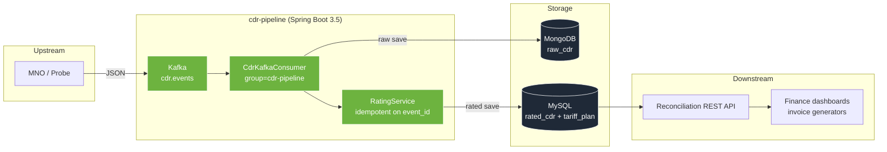
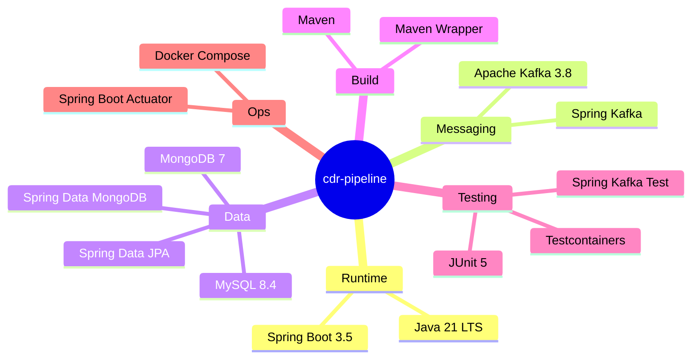
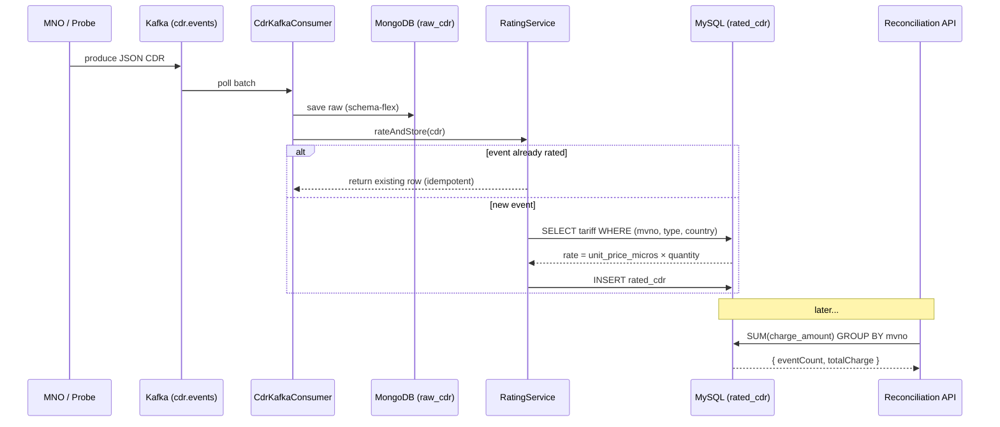

# cdr-pipeline

> Event-driven **CDR (Call Detail Record)** ingestion, rating, and reconciliation pipeline — a realistic mini-simulation of the back-end an MVNO aggregator runs to bill every SMS, voice call, and data session.

[](https://openjdk.org/projects/jdk/21/)
[](https://spring.io/projects/spring-boot)
[](https://kafka.apache.org/)
[](https://www.mysql.com/)
[](https://www.mongodb.com/)
[](https://www.docker.com/)
[](LICENSE)
[](#status)

---

## Why this exists

TRANSATEL, Lebara, Tesla's connected-car SIM, and thousands of other MVNOs don't own cell towers — they **rent capacity from MNOs (Orange, Vodafone, T-Mobile)** and resell it under their own brand. The invisible software glue between them has to do one job without ever failing: **capture every billable event, rate it against the right tariff, and make the numbers reconcile** when the MNO sends its monthly statement.

This project is a focused simulation of that pipeline — not a toy, not a demo-ware — built to showcase the exact stack a telco back-end engineer uses every day.

## At a glance



## Features

### Ingestion

- Kafka consumer group (`cdr-pipeline`) with manual-offset-ready plumbing (auto-commit off)
- JSON deserialization hardened by `ErrorHandlingDeserializer` so a poison pill never kills the consumer
- Every event persisted raw to MongoDB (schema-flexible for upstream format drift)

### Rating

- Tariff catalog composite-keyed on `(mvno_id, type, country_iso2)`
- Micros-precision `BigDecimal` arithmetic — no `double` rounding bugs in billing
- `RatingService.rateAndStore` is **idempotent** — keyed on `event_id`, replaying a Kafka offset never double-charges

### Reconciliation

- REST endpoint returns per-MVNO total charges + event counts over any time window
- `@Query` uses a coalesced sum to avoid null-vs-empty bugs
- Composite indexes `(mvno_id, occurred_at)` and `(subscriber_id)` for sub-second lookups

### Developer experience

- One `docker compose up` brings Kafka, MySQL, MongoDB up locally
- Testcontainers integration baseline — real infrastructure in CI, no mocks
- Spring Boot actuator endpoints exposed for `/health`, `/info`, `/metrics`

## Tech stack



## Getting started

### Prerequisites

- Java 21 (Temurin recommended)
- Docker 24+
- Maven Wrapper is bundled — no global Maven needed

### Run locally

```bash
# 1. Clone
git clone https://github.com/soneeee22000/cdr-pipeline.git
cd cdr-pipeline

# 2. Bring up Kafka + MySQL + MongoDB
docker compose up -d

# 3. Run the Spring Boot app (auto-seeds tariff_plan on first boot)
./mvnw spring-boot:run
```

Service starts on `http://localhost:8080`. Actuator is at `/actuator/health`.

### Publish a sample CDR

```bash
bash scripts/produce-sample.sh
```

or manually:

```bash
docker exec -i cdr-kafka /opt/kafka/bin/kafka-console-producer.sh \
  --broker-list localhost:9092 \
  --topic cdr.events <<'EOF'
{"eventId":"evt-0001","mvnoId":"mvno-acme","subscriberId":"sub-123","mnoId":"orange-fr","countryIso2":"FR","type":"SMS_MO","quantity":1,"occurredAt":"2026-04-20T10:15:00Z"}
EOF
```

### Query the reconciliation API

```bash
curl "http://localhost:8080/api/reconciliation/mvno-acme?from=2026-04-01T00:00:00Z&to=2026-05-01T00:00:00Z"
```

Sample response:

```json
{
  "mvnoId": "mvno-acme",
  "from": "2026-04-01T00:00:00Z",
  "to": "2026-05-01T00:00:00Z",
  "eventCount": 1,
  "totalCharge": 0.05
}
```

## Event lifecycle



## API reference

| Method | Path                                     | Purpose                                                  |
| ------ | ---------------------------------------- | -------------------------------------------------------- |
| `GET`  | `/api/reconciliation/{mvnoId}?from=&to=` | Total charges + event count for an MVNO in a time window |
| `GET`  | `/actuator/health`                       | Liveness + dependency health                             |
| `GET`  | `/actuator/metrics`                      | JVM, Kafka, JPA, MongoDB metrics                         |

## Project structure

```
cdr-pipeline/
├── docker-compose.yml              # Kafka + MySQL + MongoDB
├── pom.xml                         # Spring Boot 3.5 + Kafka + JPA + Mongo
├── scripts/produce-sample.sh       # publish a test CDR
└── src/main/java/dev/pseonkyaw/cdrpipeline/
    ├── domain/                     # Cdr, CdrType, TariffPlan, RatedCdr
    ├── ingestion/                  # Kafka consumer + raw Mongo storage
    ├── rating/                     # tariff lookup + idempotent persistence
    ├── api/                        # ReconciliationController
    └── config/                     # Kafka consumer factory + topic beans
```

## Design decisions

| Decision                                     | Why                                                                                                                                                                                                                |
| -------------------------------------------- | ------------------------------------------------------------------------------------------------------------------------------------------------------------------------------------------------------------------ |
| **Two databases (MongoDB + MySQL)**          | Raw stream in Mongo is the audit/replay source of truth and absorbs upstream schema drift. Rated stream in MySQL is relational, indexed, and fast to aggregate. This split is a standard telecom back-end pattern. |
| **Idempotency on `event_id`**                | Kafka's at-least-once semantics guarantee you will re-process events. The rating service must be safe under replay — a billing system that double-charges after a restart is worse than one that drops a message.  |
| **`unit_price_micros` (long) not `decimal`** | One SMS at €0.05 stored as 50000 micros → integer-multiply with quantity → `movePointLeft(6)` at the end. No float drift, no `BigDecimal` allocation per event on the hot path.                                    |
| **`ErrorHandlingDeserializer`**              | A single malformed JSON message should not stop the consumer group. Real production traffic always has dirty bytes.                                                                                                |
| **`spring.jpa.open-in-view: false`**         | No hidden lazy loads in the controller layer. Web threads don't hold DB sessions.                                                                                                                                  |

## Status

Portfolio project — not production. The upstream probe is simulated, TLS and multi-tenant isolation are out of scope, the tariff catalog is seeded locally. Built to demonstrate Spring Boot idiomatic structure, Kafka consumer semantics, the raw-vs-rated telecom-billing split, and readiness to drop into a real telecom back-end team.

## License

MIT — see [LICENSE](LICENSE).

## Author

**Pyae Sone (Seon)** — [@soneeee22000](https://github.com/soneeee22000) · [linkedin.com/in/pyae-sone-kyaw](https://linkedin.com/in/pyae-sone-kyaw) · [pseonkyaw.dev](https://pseonkyaw.dev)

Paris-based back-end engineer transitioning from Python/TypeScript/AI to JVM back-end for MVNO and core-network work. Dual Master's from Telecom SudParis / Institut Polytechnique de Paris.
